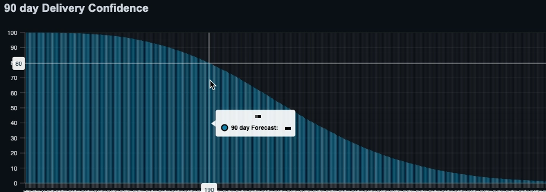

## Overview

With the establishment that [estimation is not effective for planning](../2023/agile-estimation), we need a way to forecast project timelines. Fortunately, there is a more effective way to predict project timelines using data-driven forecasting techniques. In this post, I'll discuss this technique, how it works, and a [desktop GUI tool](https://github.com/andrew-codes/forecast-work-oss?tab=readme-ov-file#how-do-i-get-started) I've written to aid in employing it.

> See [Agile Estimation](../2023/agile-estimation) for more information on the purpose of estimation.

## A Tale of Two Problems

When forecasting work, we typically want clarity on one of two questions.

1. When will the work be done; i.e., what is the delivery date?
2. How much work can we get done by a certain date?

Additionally, we want a way to answer these questions dynamically; including as the project progresses and when people are added or pulled off the work. This is where data-driven forecasting comes in. We can leverage a teams' historical data to predict future outcomes. We do this with a technique called a Monte Carlo simulation.

## Monte Carlo Simulation

A Monte Carlo simulation is a technique used to understand the impact of risk and uncertainty in forecasting models. It is a computerized mathematical technique that allows people to account for risk in quantitative analysis and decision-making. The technique is used by professionals in various industries, including finance, project management, energy, manufacturing, engineering, research, and development.

> A Monte Carlo simulation is a generation of thousands of possible outcomes and the likelihood of each outcome occurring.

The Monte Carlo simulation is a powerful tool because it allows for the generation of tens of thousands of possible outcomes. By using random sampling, we can simulate a delivery date based on historical delivery times. This allows us to understand the range of possible outcomes and the likelihood of each outcome occurring. This not only gives us a range of delivery dates but also the probability or confidence factor of hitting any given one.

The unique thing about this technique is that it is data-driven. We use historical data to predict future outcomes. This is a significant departure from traditional estimation techniques that rely on gut feelings or expert opinions. Additionally, it enables us to forecast project timelines dynamically. As the project progresses, we can update the model with new data to get a more accurate forecast. As people are added or pulled off the work, we can adjust the model to understand the impact on the delivery date. This allows us to constantly hone in on the delivery date as the project progresses and communicate these updates to stakeholders sooner.

## What Data is Required to Forecast?

> Only the completion data of each story is required to forecast project timelines.

The only required historical data is the date that a story was completed. No other data is needed; start dates, story points or sizings, etc. are not required. This is because we are only interested in the throughput of the team, i.e., how many stories are completed in a given time period.

## How Does it Work?

Given the throughput data, we can take a random sampling to create a single forecast. We then repeat this process, say 20,000 times. Some scenarios will occur more than once. We can plot the number of times each scenario occurs, which creates a normal distribution. The probability of any scenario is the value of the area underneath its curve.

This is then calculated for every point in the distribution. The result is a range of possible delivery dates and the probability of hitting any given one. These probabilities are then sorted and plotted to create a cumulative distribution function (CDF). This is a graph that shows the probability of hitting a delivery date or sooner.

## Final Thoughts

There is a lot of statistics and math involved to make these calculations; which can be cumbersome to do by hand. I've written a [desktop GUI tool](https://github.com/andrew-codes/forecast-work-oss?tab=readme-ov-file#how-do-i-get-started) to aid in employing this technique. The tool is open source and available for download. It allows you to input your data as a CSV. It then calculates the throughput data and generates a forecast. You can then adjust the confidence level to get a more accurate forecast. One note is that the tool currently only answers the second question in our list above. I hope to implement the first question in the future and welcome any pull requests to help with this.
