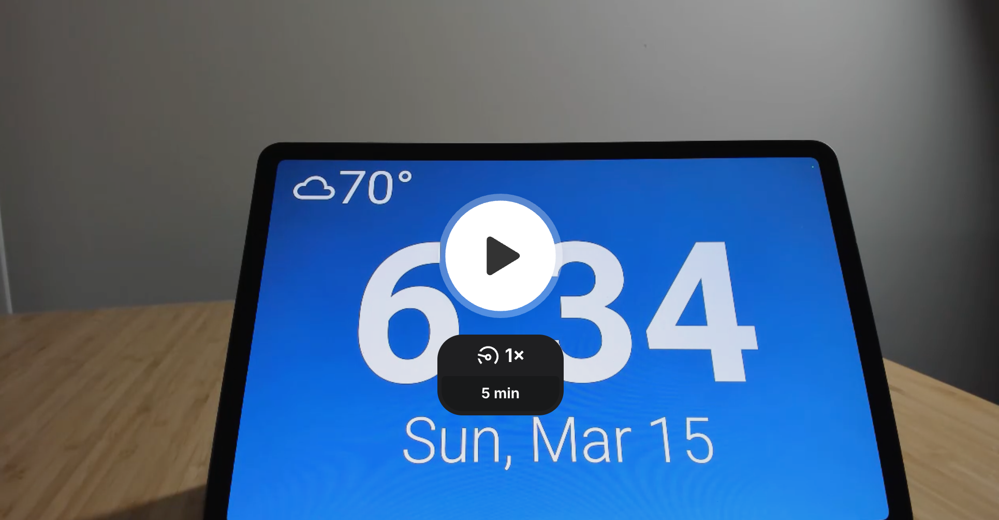
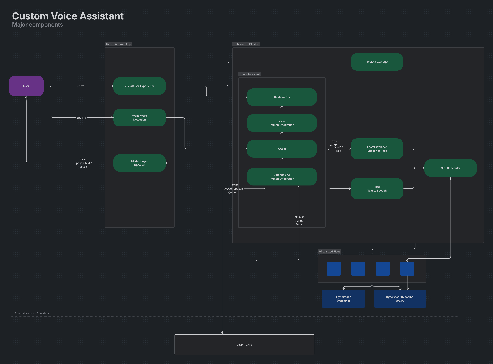

I am a home automation enthusiast and love building and learning new things. My smart home is already configured with all sorts of fun and useful automations, but I wanted to build the missing link: a voice assistant tailored to how I actually live.

This article is a wider versus deeper look at the system. Before diving into the design, let us start with what it looks like in action.

## Demo

> The demo is running on a testing tablet. For this reason, the default home screen is not the game room remote control app, Playnite Web. More details on Playnite Web are in the setup section.

## Goals

Let us outline a few scenarios I want this assistant to handle.

| Scenario             | Goal                                                                                                                        |
| :------------------- | :-------------------------------------------------------------------------------------------------------------------------- |
| Weather              | Help me make choices when I am getting ready, so I am wearing weather-appropriate clothing.                                 |
| Set timers           | One or more timers can be set at a time.                                                                                    |
| Guest wifi           | Guests may not have the wifi password. Show the wifi pass phrase for the guest network.                                     |
| Party mode           | Play, pause, skip, and stop music. Show cover art for the currently playing song. I will tell it if the volume is too loud. |
| Chill out            | Change the temperature or HVAC mode when the room is too warm.                                                              |
| Locks                | Tell me if doors are locked or unlocked. Assistants can lock, but should not unlock exterior doors.                         |
| Batteries            | Let me know if any smart devices need battery replacements.                                                                 |
| Lights, fans, action | Control lights, fans, and other devices in an intuitive way.                                                                |
| Lists and groceries  | Add to-do items to my task list and groceries to my shopping list.                                                          |

## The Setup

Here is an overview of the major components that make this work.

- **Kotlin-based native Android app** 
  Runs on a tablet and handles wake word detection, response visualization, and screen sleep and wake behavior. Visualization and settings are controlled through Home Assistant via a Python integration. Using [ViewAssistant Companion app](https://github.com/msp1974/ViewAssistCompanionApp).

- **AI workloads** 
  Speech to text uses [Faster Whisper](https://github.com/SYSTRAN/faster-whisper) and text to speech uses [Piper](https://github.com/rhasspy/piper), both running in Kubernetes. A single NVIDIA GPU is shared through time-sliced resource constraints defined in deployment YAML.

- **Home Assistant** 
  Connects the Android app to AI workloads via the Wyoming protocol.

- **Python-based Home Assistant integrations** 
  Control Android app settings and connect Home Assistant Assist to OpenAI. Using [this custom integration](https://github.com/jekalmin/extended_openai_conversation).

- **Playnite Web** 
  A custom web experience for browsing and remote controlling a game library across PC, PlayStation, Xbox, and Nintendo. This is the default view for the game room tablet. See [this repo](https://public.home.playniteweb.com/).

### Architecture Snapshot

At a high level, the user speaks to the Android tablet, wake word detection hands off to Home Assistant Assist, and Home Assistant routes speech-to-text and text-to-speech through AI services running in Kubernetes. Responses are then visualized and played back on the tablet, with Home Assistant coordinating automations, tools, and external APIs.

## Challenges and Next Steps

The biggest challenge is tuning the AI prompt. There are several discrete sets of functionality (weather, music, timers, etc.) that all need to be reliably triggered by user speech. What I'm finding is that AI can struggle to consistently trigger the right functionality, especially when user speech is ambiguous or contains multiple intents. For example, "Set a timer for 10 minutes and play some music" contains two distinct actions that need to be parsed and executed correctly.

To address this, I am experimenting with a few strategies:

- **Prompt engineering**: 
  Iteratively refining the AI prompt to provide clearer instructions and examples for handling multiple intents in a single user utterance.

- **Intent classification via langchain agent**: 
  Implementing a separate, custom intent classification [agent](https://www.langchain.com/) that can first categorize user speech into distinct intents before passing it to the main AI for execution. This could help ensure that each intent is handled appropriately, even when multiple intents are present.

## Conclusion

Building a custom voice assistant for my smart home has been a rewarding project that combines AI, home automation, and user experience design. Huge shout out to the open source community for providing the tools and inspiration to make this possible. While there are challenges to overcome, especially around reliably parsing user intent, the system is already providing value and fun interactions in my daily life. I look forward to continuing to refine the AI prompt and exploring additional features and integrations in the future.
