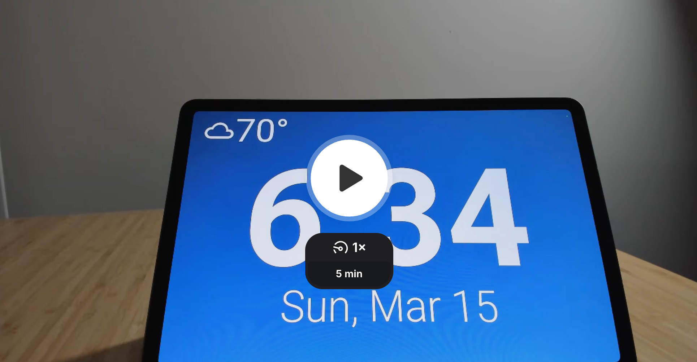
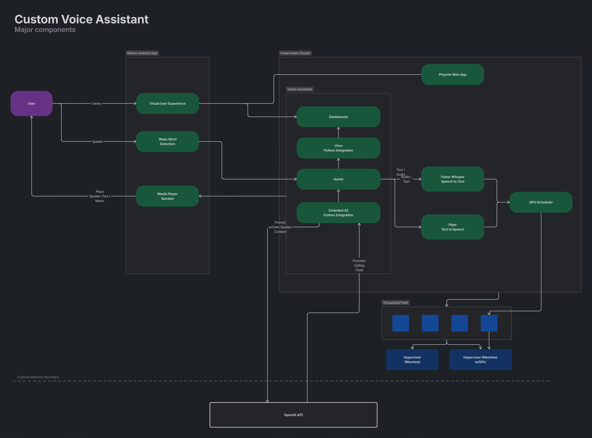

import { SiAndroid } from "react-icons/si"
import { MdMic } from "react-icons/md"
import homeAssistantLogo from "./public/files/home-assistant-logo.png"
import pythonLogo from "./public/files/python-logo.svg"
import playniteWebLogo from "./public/files/playnite-web-logo.png"
import kubernetesLogo from "./public/files/kubernetes-logo.svg"

I am a home automation enthusiast and love building and learning new things. My smart home is already configured with all sorts of fun and useful automations, but I wanted to build the missing link: a voice assistant
tailored to how I actually live.

This article is a wider versus deeper look at the system. Before diving into the design, let us start with what it looks like in action.

## Demo

> The demo is running on a testing tablet. For this reason, the default home screen is not the game room remote control app, Playnite Web. More details on Playnite Web are in the setup section.

## Why Build My Own?

The obvious question is: why not just use Alexa or Google Home?

Privacy is an immediate benefit of running your own solution, though it was not my primary motivation. The bigger driver is that commercial assistants are fundamentally general-purpose tools, and that generality comes
with real limits on customization. Building my own means I can shape the assistant around how I actually live rather than working around what a platform allows.

A few concrete examples of things my assistant does that would be difficult or impossible with off-the-shelf alternatives:

- **Grocery list integration**: Adding items to a shopping list that surfaces in home dashboards and triggers a reminder when we arrive at the relevant store, not an Alexa or Google task list.
- **Spotify with room awareness**: Playing music and targeting specific rooms or grouping them for whole-home audio, with full playback control.
- **Guest concierge**: A self-service experience that helps guests understand how to control the home without needing to ask.

There is also the honest answer: this is a hobby I enjoy. I learn an enormous amount from the process of building, not just from the end result.

## Goals

Let us outline a few scenarios I want this assistant to handle.

| Scenario             | Goal                                                                                                                        |
| :------------------- | :-------------------------------------------------------------------------------------------------------------------------- |
| Weather              | Help me make choices when I am getting ready, so I am wearing weather-appropriate clothing.                                 |
| Set timers           | One or more timers can be set at a time.                                                                                    |
| Guest wifi           | Guests may not have the wifi password. Show the wifi pass phrase for the guest network.                                     |
| Party mode           | Play, pause, skip, and stop music. Show cover art for the currently playing song. I will tell it if the volume is too loud. |
| Chill out            | Change the temperature or HVAC mode when the room is too warm.                                                              |
| Locks                | Tell me if doors are locked or unlocked. Assistants can lock, but should not unlock exterior doors.                         |
| Batteries            | Let me know if any smart devices need battery replacements.                                                                 |
| Lights, fans, action | Control lights, fans, and other devices in an intuitive way.                                                                |
| Lists and groceries  | Add to-do items to my task list and groceries to my shopping list.                                                          |

## The Setup

Here is an overview of the major components that make this work.

### <SiAndroid style={{ color: "#3ddc84" }} /> Kotlin-based native Android app

Runs on a tablet and handles wake word detection, response visualization, and screen sleep and wake behavior. Visualization and settings are controlled through Home Assistant via a Python integration. Using
[ViewAssistant Companion app](https://github.com/msp1974/ViewAssistCompanionApp).

### <MdMic style={{ color: "#c97a58" }} /> AI workloads

Speech to text uses [Faster Whisper](https://github.com/SYSTRAN/faster-whisper) and text to speech uses [Piper](https://github.com/rhasspy/piper), both running in Kubernetes. A single NVIDIA GPU is shared through
time-sliced resource constraints defined in deployment YAML.

###  Home Assistant

Connects the Android app to AI workloads via the Wyoming protocol.

###  Python-based Home Assistant integrations

Control Android app settings and connect Home Assistant Assist to OpenAI. Using [Extended OpenAI Conversation](https://github.com/jekalmin/extended_openai_conversation). The integration only supports OpenAI, and the
tradeoffs behind that choice are covered below.

###  Playnite Web

A custom web experience for browsing and remote controlling a game library across PC, PlayStation, Xbox, and Nintendo. This is the default view for the game room tablet. See
[this repo](https://public.home.playniteweb.com/).

###  Kubernetes

All AI workloads run as pods in an existing cluster managed with Flux GitOps. I already had the cluster running, so deploying here was a natural extension of existing infrastructure. GitOps makes it straightforward to
upgrade or roll back service versions without touching the underlying VM's operating system.

<CollapsibleSection title="Trade-offs and Alternatives">

Three decisions involved enough exploration to be worth calling out separately.

### Device selection

The choice of Android was driven by a hard technical constraint: iOS does not allow third-party apps to continuously listen in the background, and a browser-based UI has the same limitation. I also considered repurposing
an older Echo Show, as specific firmware versions can be rooted to run custom software, but finding a device with the right exploitable version proved unreliable in practice, and the approach is not sustainable
long-term.

### AI infrastructure

My initial setup ran both AI services on a single Debian VM, which worked but was harder to maintain than a GitOps-based approach. Moving workloads to Kubernetes meant solving GPU access layer by layer: PCIe passthrough
at the hypervisor, node-level visibility in the cluster, and then time-sliced resource distribution across multiple pods. I also explored MIG (Multi-Instance GPU) before discovering my GPU does not support it.

### LLM selection

I started building a custom Home Assistant Community Store (HACS) integration for OpenAI, but a community integration appeared that covered the same ground, so I used that instead. I also tried local LLMs, but found them
unreliable when the entire assistant is driven by a single large prompt covering many capability areas. OpenAI's cost-to-performance ratio made it the pragmatic choice for now. A future iteration will revisit local
models with a different architecture: a LangChain agent per capability area rather than one monolithic prompt, which should give local models a much better chance at reliable execution.

</CollapsibleSection>

## Architecture Snapshot

At a high level, the user speaks to the Android tablet, wake word detection hands off to Home Assistant Assist, and Home Assistant routes speech-to-text and text-to-speech through AI services running in Kubernetes.
Responses are then visualized and played back on the tablet, with Home Assistant coordinating automations, tools, and external APIs.

## Challenges and Next Steps

The biggest challenge is tuning the AI prompt. There are several discrete sets of functionality (weather, music, timers, etc.) that all need to be reliably triggered by user speech. What I'm finding is that AI can
struggle to consistently trigger the right functionality, especially when user speech is ambiguous or contains multiple intents. For example, "Set a timer for 10 minutes and play some music" contains two distinct actions
that need to be parsed and executed correctly.

To address this, I am experimenting with a few strategies:

- **Prompt engineering**:  Iteratively refining the AI prompt to provide clearer instructions and examples for handling multiple intents in a single user utterance.

- **Intent classification via langchain agent**:  Implementing a separate, custom intent classification [agent](https://www.langchain.com/) that can first categorize user speech into distinct intents before passing
  it to the main AI for execution. This could help ensure that each intent is handled appropriately, even when multiple intents are present.

## Conclusion

Building a custom voice assistant has been a rewarding project, and a huge shout out to the open source community for making it possible. The system is already providing real value in daily life, challenges around intent
parsing and all. I look forward to continuing to refine and expand it.
